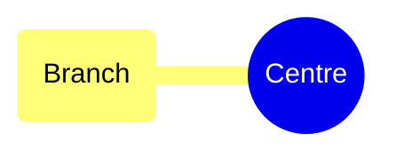
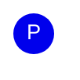

<!-- expect: diagram-heading-twice -->
# Sample

```mermaid
mindmap
  n1(("Centre"))
    n2("Branch")
```

## Details

### Branch

See [the part](#part).

## Part

```mermaid
mindmap
  p(("P"))
```

## Part

```mermaid
mindmap
  q(("Q"))
```
