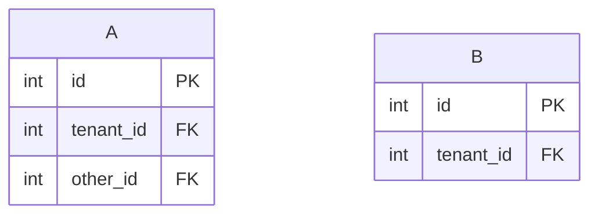

<!-- expect: relation-syntax -->
# Column connections

```mermaid
erDiagram
  A {
    int id PK
    int tenant_id FK
    int other_id FK
  }
  B {
    int id PK
    int tenant_id FK
  }
```

## Relations
- A.missing bad@}o--|| B.id : bad
