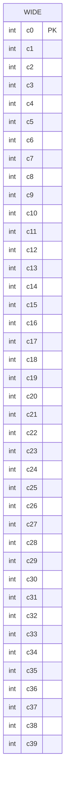

# Column perspective

```mermaid
erDiagram
  WIDE {
    int c0 PK
    int c1
    int c2
    int c3
    int c4
    int c5
    int c6
    int c7
    int c8
    int c9
    int c10
    int c11
    int c12
    int c13
    int c14
    int c15
    int c16
    int c17
    int c18
    int c19
    int c20
    int c21
    int c22
    int c23
    int c24
    int c25
    int c26
    int c27
    int c28
    int c29
    int c30
    int c31
    int c32
    int c33
    int c34
    int c35
    int c36
    int c37
    int c38
    int c39
  }
```

## Perspective: Five fields

#### Perspective options
- Columns: WIDE.c0, WIDE.c1, WIDE.c2, WIDE.c3, WIDE.c4
