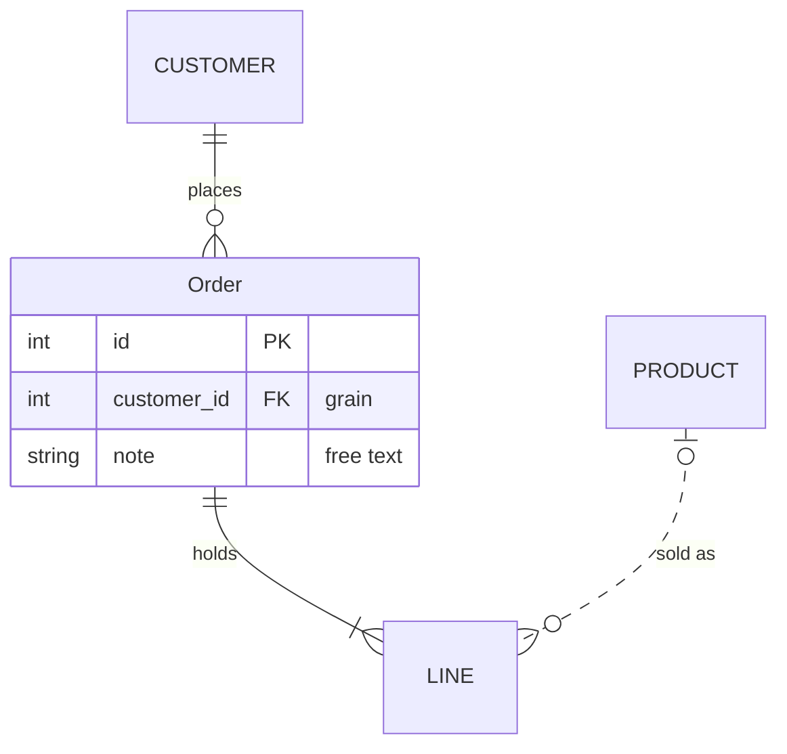

# Sample

```mermaid
erDiagram
  CUSTOMER ||--o{ ORDER : places
  ORDER ||--|{ LINE : holds
  PRODUCT |o..o{ LINE : "sold as"
  ORDER["Order"] {
    int id PK
    int customer_id FK "grain"
    string note "free text"
  }
  LINE:::fact
  classDef big stroke-width:3px
```
