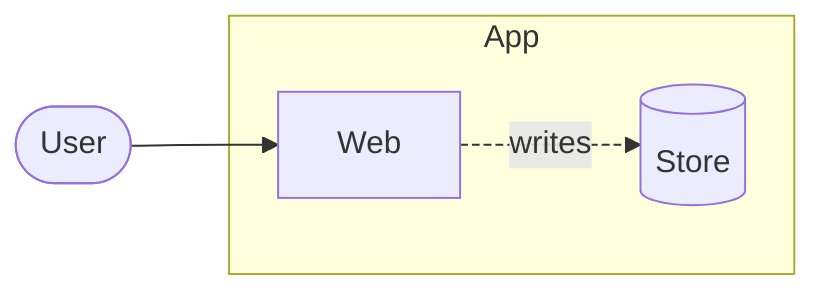
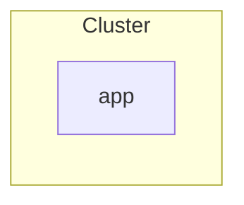

# Sample

```mermaid
flowchart LR
  subgraph app [App]
    a["Web"]
    b[("Store")]
  end
  u(["User"])
  u e1@--> a
  a e2@-->|writes| b
  class u person
  class e2 money
  classDef money stroke-dasharray: 4 2
```

## Perspective: Reads

- b r1@--> a : rows

## Node icons

- a : verified
- e1 : inferred
- r1 : unsourced

## Classes

- money : - : Payments

## Deployment: Prod, Test

```mermaid
flowchart LR
  subgraph k8s [Cluster]
    app
  end
```
