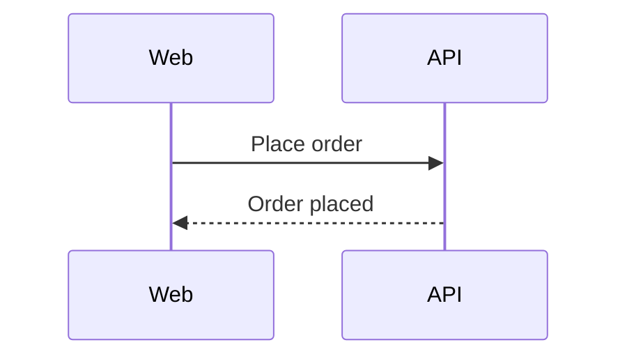

<!-- expect: -->
# Sample

Icons on sequence messages, by message id (`%% id:`), as for arrows: no problem.

```mermaid
sequenceDiagram
    participant web as Web
    participant api as API
    %% id: r1
    web->>api: Place order
    %% id: r2
    api-->>web: Order placed
```

## Node icons

- r1 : ph shopping-cart
- r2 : ph check-circle status-green
