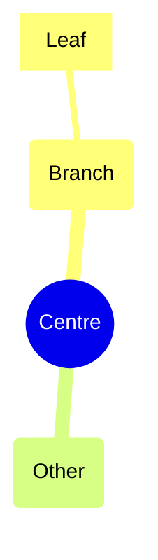

# Sample

```mermaid
mindmap
  n1(("Centre"))
    n2("Branch")
    ::icon(verified)
      n3["Leaf"]
    n4("Other")
```

## Relations

- n3 e1@--> n4 : feeds

## Node icons

- e1 : hypothesis

## Details

### Branch

Checked in the code.

### Feeds

A guess.
