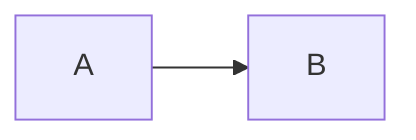

<!-- expect: -->
# Sample

```mermaid
flowchart LR
  a["A"] --> b["B"]
```

## Opening walk: Main

## Walkthrough: Main

A sample, for a reader of the checker. Its point: one walk.

### Diagram: Sample

The whole picture.
