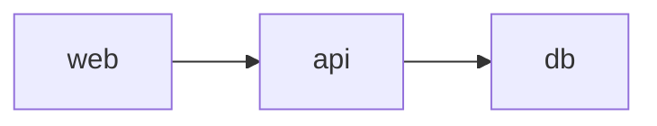
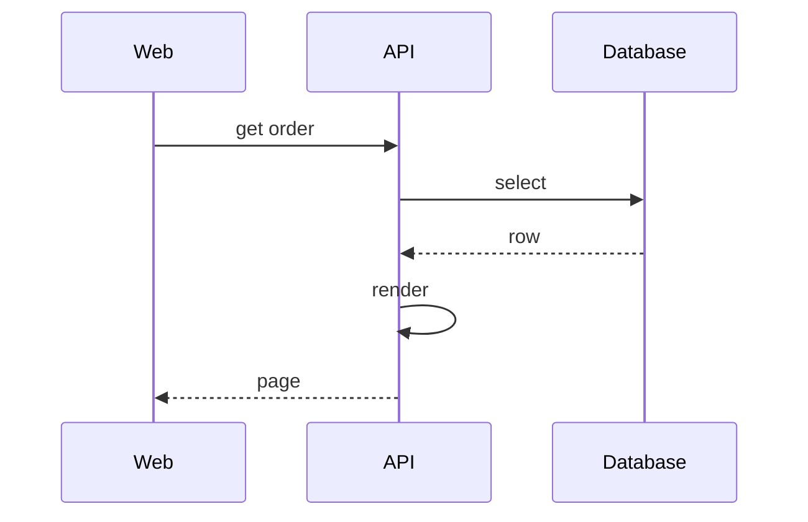

# Sample

```mermaid
flowchart LR
  web --> api --> db
```

## Perspective: Calls

- web --> api : calls
- api --> db : reads

## Lookup

```mermaid
sequenceDiagram
  participant web as Web
  participant api as API
  participant db as Database
  %% id: m1
  web->>api: get order
  api->>db: select
  db-->>api: row
  api->>api: render
  api-->>web: page
```

## Plays over

- #sample : Calls

## Details

### Get order

The first call.
