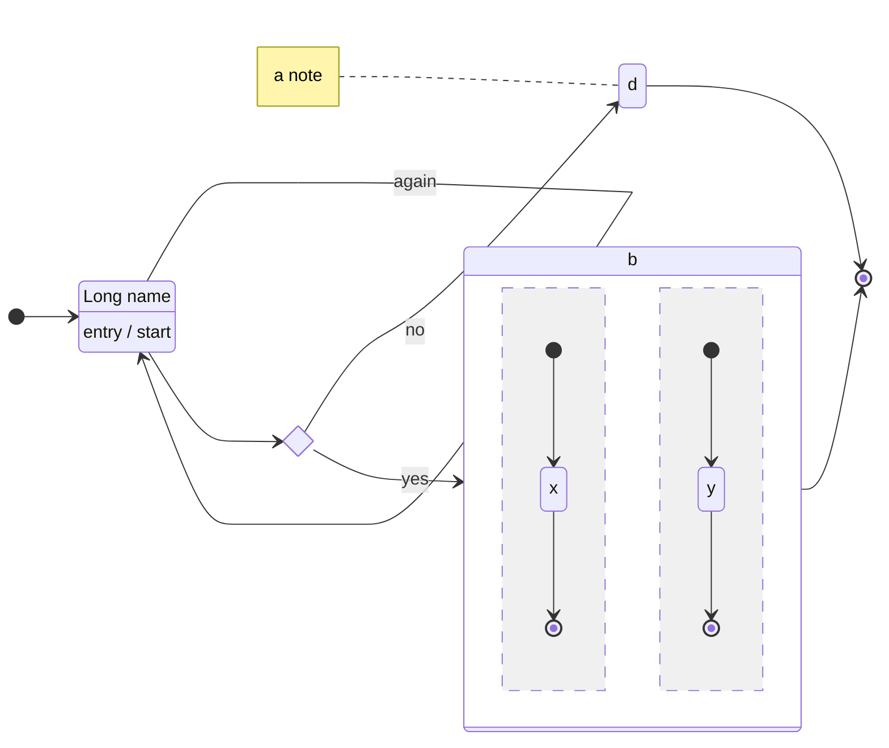

# Sample

```mermaid
stateDiagram-v2
  direction LR
  state "Long name" as a
  [*] --> a
  a : entry / start
  a --> a : again
  state c <<choice>>
  a --> c
  c --> b : yes
  c --> d : no
  state b {
    [*] --> x
    x --> [*]
    --
    [*] --> y
    y --> [*]
  }
  b --> [*]
  d --> [*]
  note left of d : a note
```
