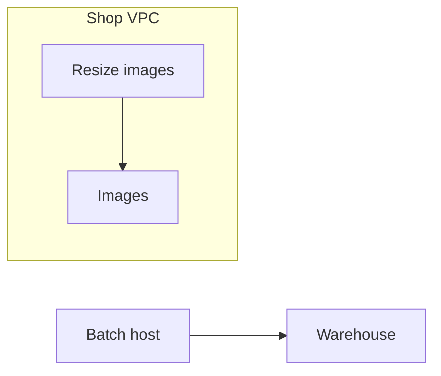

# Cloud icons

```mermaid
flowchart LR
  subgraph vpc [Shop VPC]
    fn["Resize images"]
    bucket["Images"]
  end
  vm["Batch host"]
  bq["Warehouse"]
  fn --> bucket
  vm --> bq
```

## Node icons
- vpc : aws vpc
- fn : aws lambda
- bucket : aws s3
- vm : azure virtual-machine
- bq : gcp bigquery
