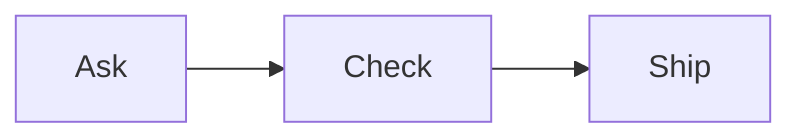

<!-- expect: lanes-cell-order -->
# Sample

```mermaid
flowchart LR
  a[Ask] --> b[Check]
  b --> c[Ship]
```

## Lanes

### Rows
- x : X

### Columns
- one : One
- two : Two

### Placement
- b, a : x : one
- c : x : two
