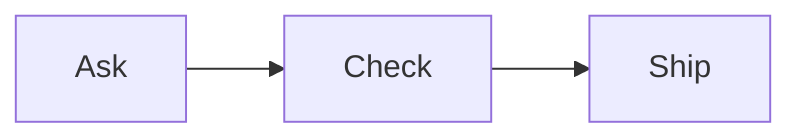
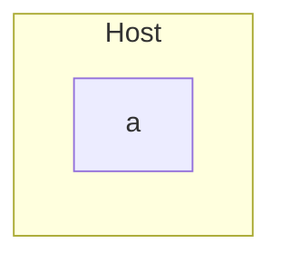

<!-- expect: lanes-deployment -->
# Sample

```mermaid
flowchart LR
  a[Ask] --> b[Check]
  b --> c[Ship]
```

## Lanes

### Rows
- x : X

### Placement
- a, b, c : x

## Deployment: Production

```mermaid
flowchart LR
  subgraph host [Host]
    a
  end
```
