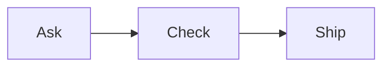

<!-- expect: lanes-parent-order -->
# Sample

```mermaid
flowchart LR
  a[Ask] --> b[Check]
  b --> c[Ship]
```

## Lanes

### Rows
- x : X
- y : Y
- z : Z

### Parent rows
- team : Team : x, z

### Placement
- a : x
- b : y
- c : z
