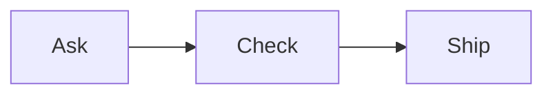

<!-- expect: lanes-parent-unknown-child -->
# Sample

```mermaid
flowchart LR
  a[Ask] --> b[Check]
  b --> c[Ship]
```

## Lanes

### Rows
- x : X
- y : Y

### Parent rows
- team : Team : x, nobody

### Placement
- a : x
- b, c : y
