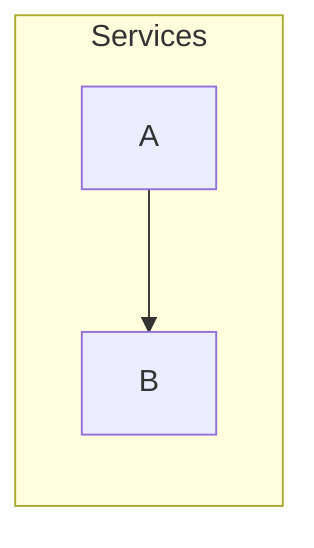

<!-- expect: perspective-options -->
# Example

```mermaid
flowchart LR
 subgraph services [Services]
   a["A"] --> b["B"]
 end
```

## Details

### A

A note.

## Perspective: Calls

- a --> b : calls

#### Perspective options

- Open: missing
