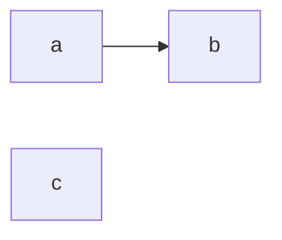
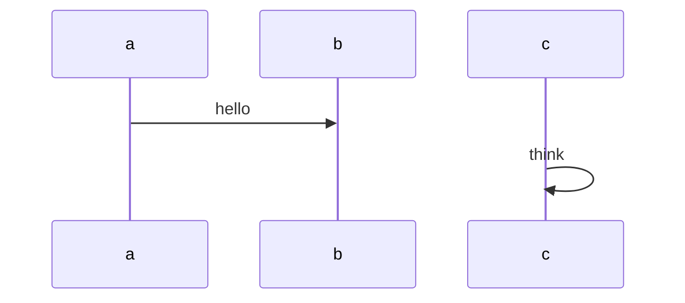

<!-- expect: sequence-not-in-view -->
# Sample

```mermaid
flowchart LR
  a --> b
  c
```

## Perspective: Calls

- a --> b : calls

## Hello

```mermaid
sequenceDiagram
  a->>b: hello
  c->>c: think
```

## Plays over

- #sample : Calls
