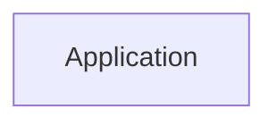

<!-- expect: verification-pair -->
# Text without mark

```mermaid
flowchart LR
  app[Application]
```

## Details

### Application

#### Evidence

This verification explanation deliberately has no matching trust mark.
