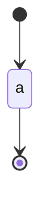

<!-- expect: walkthrough-stop-kind -->
# Sample

```mermaid
stateDiagram-v2
  [*] --> a
  a --> [*]
```

## Walkthrough: Odd stop

What the sample is, and who the walk is for.

### Thing: Sample

A stop whose kind is not one of the six.
