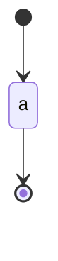

<!-- expect: walkthrough-twice -->
# Sample

```mermaid
stateDiagram-v2
  [*] --> a
  a --> [*]
```

## Walkthrough: Same

### Diagram: Sample

One stop.

## Walkthrough: Same

### Diagram: Sample

Another stop.
