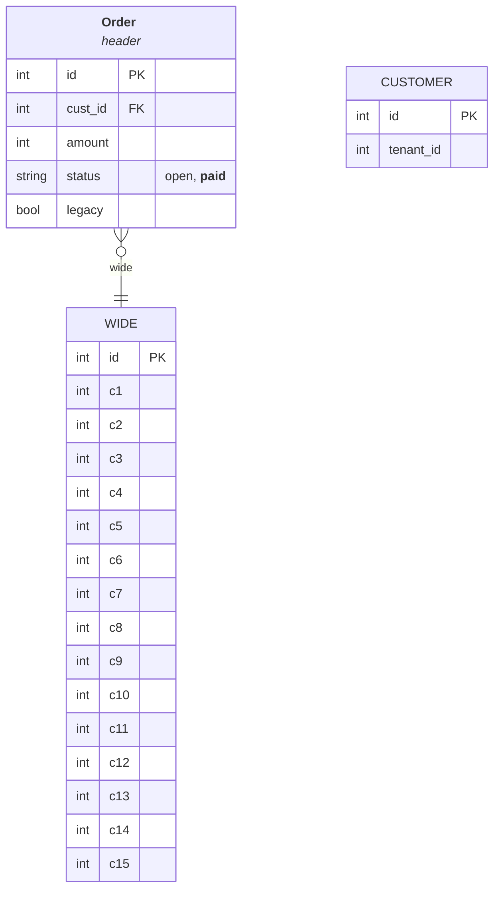

# Orders compared

```mermaid
erDiagram
  ORDER["**Order**<br>_header_"] {
    int id PK
    int cust_id FK
    int amount
    string status "open, **paid**"
    bool legacy
  }
  CUSTOMER {
    int id PK
    int tenant_id
  }
  WIDE {
    int id PK
    int c1
    int c2
    int c3
    int c4
    int c5
    int c6
    int c7
    int c8
    int c9
    int c10
    int c11
    int c12
    int c13
    int c14
    int c15
  }
  ORDER }o--|| WIDE : "wide"
```

## Relations
- ORDER.cust_id oc@}o--|| CUSTOMER.id : placed by
